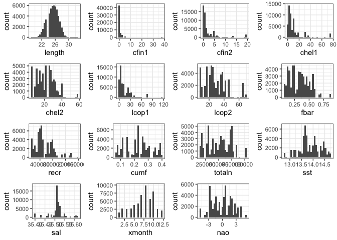
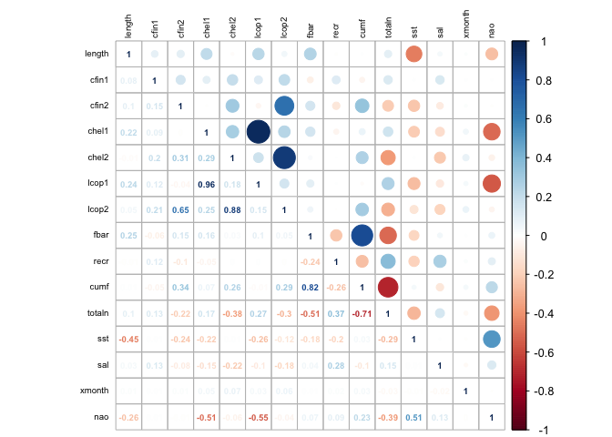
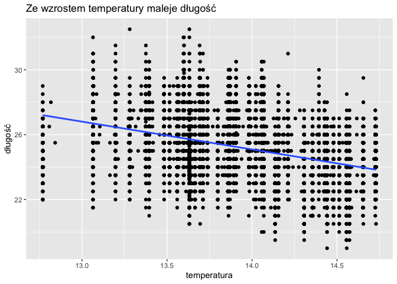
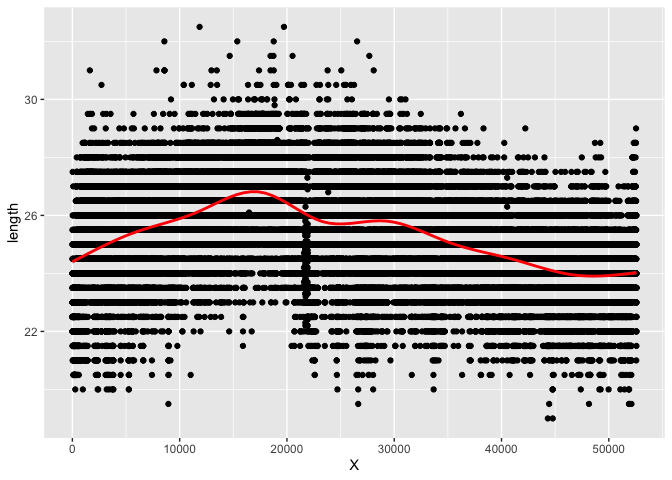

-   [🐟 Śledzie](#śledzie)
    -   [0. Wstęp](#wstęp)
    -   [1. Kod wyliczający wykorzystane
        biblioteki](#kod-wyliczający-wykorzystane-biblioteki)
    -   [2. Kod zapewniający powtarzalność wyników przy każdym
        uruchomieniu raportu na tych samych
        danych.](#kod-zapewniający-powtarzalność-wyników-przy-każdym-uruchomieniu-raportu-na-tych-samych-danych.)
    -   [3. Kod pozwalający wczytać dane z
        pliku](#kod-pozwalający-wczytać-dane-z-pliku)
    -   [4. Kod przetwarzający brakujące
        dane](#kod-przetwarzający-brakujące-dane)
    -   [5. Sekcja podsumowująca rozmiar zbioru i podstawowe
        statystyki](#sekcja-podsumowująca-rozmiar-zbioru-i-podstawowe-statystyki)
    -   [6. Szczegółowa analiza wartości
        atrybutów](#szczegółowa-analiza-wartości-atrybutów)
    -   [7. Sekcja sprawdzającą korelacje między
        zmiennymi](#sekcja-sprawdzającą-korelacje-między-zmiennymi)
    -   [8. Interaktywny wykres lub animację prezentującą zmianę
        rozmiaru śledzi w
        czasie](#interaktywny-wykres-lub-animację-prezentującą-zmianę-rozmiaru-śledzi-w-czasie)
    -   [9. Sekcja regresora przewidującego rozmiar śledzia, parametry
        modelu oraz oszacowanie jego
        skuteczności](#sekcja-regresora-przewidującego-rozmiar-śledzia-parametry-modelu-oraz-oszacowanie-jego-skuteczności)
        -   [kNN](#knn)
        -   [kNN](#knn-1)
        -   [Random Forest](#random-forest)
    -   [10. Analiza ważności atrybutów najlepszego znalezionego modelu
        regresji](#analiza-ważności-atrybutów-najlepszego-znalezionego-modelu-regresji)

🐟 Śledzie
=========

> Projekt z Eksploracji Masywnych Danych, analiza długości śledzi


0. Wstęp
--------

Długość śledzi oceanicznych w Europie zmniejsza się wraz z upływem lat.
W niniejszym raporcie przeanalizowano dane z połowów komercyjnych
jednostek przez ostatnie 60 lat. W ramach połowu losowo wybierano od 50
do 100 sztuk trzyletnich śledzi. Wykonano m.in. interpretację i analizę
atrybutów, analizę korelacji atrybutów, stworzenie klasyfikatorów w celu
znalezienia najistotniejszej cechy.

1. Kod wyliczający wykorzystane biblioteki
------------------------------------------

    ##  [1] "knitr"      "kableExtra" "plotly"     "dplyr"      "tidyverse" 
    ##  [6] "ggplot2"    "ggExtra"    "cowplot"    "gridExtra"  "imputeTS"  
    ## [11] "corrplot"   "reshape2"   "caret"      "gganimate"  "png"       
    ## [16] "gifski"

2. Kod zapewniający powtarzalność wyników przy każdym uruchomieniu raportu na tych samych danych.
-------------------------------------------------------------------------------------------------

``` r
set.seed(40)
```

3. Kod pozwalający wczytać dane z pliku
---------------------------------------

``` r
headers <- read.table("sledzie.csv", nrow=1, stringsAsFactors = FALSE, sep = ",")
content <- read.table("sledzie.csv", header=TRUE, stringsAsFactors = FALSE, sep=",", na.strings = c("", "?", "NA"))

head(content)
```

    ##   X length   cfin1   cfin2   chel1    chel2   lcop1    lcop2  fbar   recr
    ## 1 0   23.0 0.02778 0.27785 2.46875       NA 2.54787 26.35881 0.356 482831
    ## 2 1   22.5 0.02778 0.27785 2.46875 21.43548 2.54787 26.35881 0.356 482831
    ## 3 2   25.0 0.02778 0.27785 2.46875 21.43548 2.54787 26.35881 0.356 482831
    ## 4 3   25.5 0.02778 0.27785 2.46875 21.43548 2.54787 26.35881 0.356 482831
    ## 5 4   24.0 0.02778 0.27785 2.46875 21.43548 2.54787 26.35881 0.356 482831
    ## 6 5   22.0 0.02778 0.27785 2.46875 21.43548 2.54787       NA 0.356 482831
    ##        cumf   totaln      sst      sal xmonth nao
    ## 1 0.3059879 267380.8 14.30693 35.51234      7 2.8
    ## 2 0.3059879 267380.8 14.30693 35.51234      7 2.8
    ## 3 0.3059879 267380.8 14.30693 35.51234      7 2.8
    ## 4 0.3059879 267380.8 14.30693 35.51234      7 2.8
    ## 5 0.3059879 267380.8 14.30693 35.51234      7 2.8
    ## 6 0.3059879 267380.8 14.30693 35.51234      7 2.8

4. Kod przetwarzający brakujące dane
------------------------------------

``` r
content$cfin1 <- na_kalman(content$cfin1)
content$cfin2 <- na_kalman(content$cfin2)
content$chel1 <- na_kalman(content$chel1)
content$chel2 <- na_kalman(content$chel2)
content$lcop1 <- na_kalman(content$lcop1)
content$lcop2 <- na_kalman(content$lcop2)
content$sst <- na_kalman(content$sst)

head(content)
```

    ##   X length   cfin1   cfin2   chel1    chel2   lcop1    lcop2  fbar   recr
    ## 1 0   23.0 0.02778 0.27785 2.46875 21.43549 2.54787 26.35881 0.356 482831
    ## 2 1   22.5 0.02778 0.27785 2.46875 21.43548 2.54787 26.35881 0.356 482831
    ## 3 2   25.0 0.02778 0.27785 2.46875 21.43548 2.54787 26.35881 0.356 482831
    ## 4 3   25.5 0.02778 0.27785 2.46875 21.43548 2.54787 26.35881 0.356 482831
    ## 5 4   24.0 0.02778 0.27785 2.46875 21.43548 2.54787 26.35881 0.356 482831
    ## 6 5   22.0 0.02778 0.27785 2.46875 21.43548 2.54787 26.35881 0.356 482831
    ##        cumf   totaln      sst      sal xmonth nao
    ## 1 0.3059879 267380.8 14.30693 35.51234      7 2.8
    ## 2 0.3059879 267380.8 14.30693 35.51234      7 2.8
    ## 3 0.3059879 267380.8 14.30693 35.51234      7 2.8
    ## 4 0.3059879 267380.8 14.30693 35.51234      7 2.8
    ## 5 0.3059879 267380.8 14.30693 35.51234      7 2.8
    ## 6 0.3059879 267380.8 14.30693 35.51234      7 2.8

5. Sekcja podsumowująca rozmiar zbioru i podstawowe statystyki
--------------------------------------------------------------

Rozmiar zbioru:

``` r
nrow(content)
```

    ## [1] 52582

Podstawowe statystyki:

``` r
content %>%
  summary()
```

    ##        X             length         cfin1             cfin2        
    ##  Min.   :    0   Min.   :19.0   Min.   : 0.0000   Min.   : 0.0000  
    ##  1st Qu.:13145   1st Qu.:24.0   1st Qu.: 0.0000   1st Qu.: 0.2778  
    ##  Median :26290   Median :25.5   Median : 0.1111   Median : 0.7012  
    ##  Mean   :26290   Mean   :25.3   Mean   : 0.4460   Mean   : 2.0255  
    ##  3rd Qu.:39436   3rd Qu.:26.5   3rd Qu.: 0.3333   3rd Qu.: 1.7936  
    ##  Max.   :52581   Max.   :32.5   Max.   :37.6667   Max.   :19.3958  
    ##      chel1            chel2            lcop1              lcop2       
    ##  Min.   : 0.000   Min.   : 5.238   Min.   :  0.3074   Min.   : 7.849  
    ##  1st Qu.: 2.469   1st Qu.:13.427   1st Qu.:  2.5479   1st Qu.:17.808  
    ##  Median : 5.750   Median :21.436   Median :  7.0000   Median :24.859  
    ##  Mean   :10.004   Mean   :21.217   Mean   : 12.8053   Mean   :28.421  
    ##  3rd Qu.:11.500   3rd Qu.:27.193   3rd Qu.: 21.2315   3rd Qu.:37.232  
    ##  Max.   :75.000   Max.   :57.706   Max.   :115.5833   Max.   :68.736  
    ##       fbar             recr              cumf             totaln       
    ##  Min.   :0.0680   Min.   : 140515   Min.   :0.06833   Min.   : 144137  
    ##  1st Qu.:0.2270   1st Qu.: 360061   1st Qu.:0.14809   1st Qu.: 306068  
    ##  Median :0.3320   Median : 421391   Median :0.23191   Median : 539558  
    ##  Mean   :0.3304   Mean   : 520366   Mean   :0.22981   Mean   : 514973  
    ##  3rd Qu.:0.4560   3rd Qu.: 724151   3rd Qu.:0.29803   3rd Qu.: 730351  
    ##  Max.   :0.8490   Max.   :1565890   Max.   :0.39801   Max.   :1015595  
    ##       sst             sal            xmonth            nao          
    ##  Min.   :12.77   Min.   :35.40   Min.   : 1.000   Min.   :-4.89000  
    ##  1st Qu.:13.60   1st Qu.:35.51   1st Qu.: 5.000   1st Qu.:-1.89000  
    ##  Median :13.86   Median :35.51   Median : 8.000   Median : 0.20000  
    ##  Mean   :13.88   Mean   :35.51   Mean   : 7.258   Mean   :-0.09236  
    ##  3rd Qu.:14.16   3rd Qu.:35.52   3rd Qu.: 9.000   3rd Qu.: 1.63000  
    ##  Max.   :14.73   Max.   :35.61   Max.   :12.000   Max.   : 5.08000

6. Szczegółowa analiza wartości atrybutów
-----------------------------------------

Rozkład cech:

``` r
plots <- (
  lapply(names(content)[-1], function(var_x) {
    ggplot(content) + aes_string(var_x) + geom_histogram() + theme_bw()
  })
)

plot_grid(plotlist = plots)
```

    ## `stat_bin()` using `bins = 30`. Pick better value with `binwidth`.
    ## `stat_bin()` using `bins = 30`. Pick better value with `binwidth`.
    ## `stat_bin()` using `bins = 30`. Pick better value with `binwidth`.
    ## `stat_bin()` using `bins = 30`. Pick better value with `binwidth`.
    ## `stat_bin()` using `bins = 30`. Pick better value with `binwidth`.
    ## `stat_bin()` using `bins = 30`. Pick better value with `binwidth`.
    ## `stat_bin()` using `bins = 30`. Pick better value with `binwidth`.
    ## `stat_bin()` using `bins = 30`. Pick better value with `binwidth`.
    ## `stat_bin()` using `bins = 30`. Pick better value with `binwidth`.
    ## `stat_bin()` using `bins = 30`. Pick better value with `binwidth`.
    ## `stat_bin()` using `bins = 30`. Pick better value with `binwidth`.
    ## `stat_bin()` using `bins = 30`. Pick better value with `binwidth`.
    ## `stat_bin()` using `bins = 30`. Pick better value with `binwidth`.
    ## `stat_bin()` using `bins = 30`. Pick better value with `binwidth`.
    ## `stat_bin()` using `bins = 30`. Pick better value with `binwidth`.



7. Sekcja sprawdzającą korelacje między zmiennymi
-------------------------------------------------

``` r
par(xpd=TRUE)
corrplot.mixed(cor(content[-1]), tl.srt = 90, tl.pos="lt", diag = "l", tl.col="black", number.cex=.6, tl.cex=.6, mar = c(0, 0, 2, 0))
```



-   Można zauważyć dodatnią korelację pomiędzy *chel1* (zagęszczenie
    Calanus helgolandicus gat. 1) a *lcop1* (zagęszczenie widłonogów
    gat. 1) \~= `0.96`
-   Można zauważyć dodatnią korelację pomiędzy *chel2* (zagęszczenie
    Calanus helgolandicus gat. 2) a *lcop2* (zagęszczenie widłonogów
    gat. 2) \~= `0.88`
-   Można zauważyć dodatnią korelację pomiędzy *cfin2* (zagęszczenie
    Calanus finmarchicus gat. 2) a *lcop2* (zagęszczenie widłonogów
    gat. 2) \~= `0.65`
-   Można zauważyć dodatnią korelację pomiędzy *sst* (temperatura przy
    powierzchni wody \[°C\]) a *nao* (oscylacja północnoatlantycka
    \[mb\]) \~= `0.51`
-   *\[Najciekawsze\]* - można zauważyć ujemną korelację pomiędzy
    *length* (długość złowionego śledzia \[cm\]) a *sst* (temperatura
    przy powierzchni wody) \~= `-0.45`

``` r
ggplot(content, aes(sst, length)) + geom_point() + geom_smooth(method="lm") + ylab(sprintf("długość")) + xlab("temperatura") + ggtitle("Ze wzrostem temperatury maleje długość")
```



8. Interaktywny wykres lub animację prezentującą zmianę rozmiaru śledzi w czasie
--------------------------------------------------------------------------------

``` r
p <- ggplot(content, aes(X, length)) +
  geom_point() +
  geom_smooth(method = "auto", color = "red")

# ggplotly(p) - Plotly is not working for me - dependency issue

p
```

    ## `geom_smooth()` using method = 'gam' and formula 'y ~ s(x, bs = "cs")'



-   Można zauważyć wzrost długości śledzia do pewnego momentu
    (\~row 17500) po czym następuje spadek długości.

9. Sekcja regresora przewidującego rozmiar śledzia, parametry modelu oraz oszacowanie jego skuteczności
-------------------------------------------------------------------------------------------------------

Podzielmy dane na: - zbiór *uczący* - `0.75` zbioru początkowego - zbiór
*testowy* - `0.25` zbioru początkowego

``` r
normalized_content <- data.frame(content[-1])

training_indexes <- createDataPartition(y = normalized_content$length, p = .75, list = FALSE)

training_set <- normalized_content[ training_indexes]
testing_set  <- normalized_content[-training_indexes]

rounded_content <- sapply(normalized_content$length, round, digits = 0)

control_params <- trainControl( method = "repeatedcv", number = 5, repeats = 10)
```

### kNN

``` r
set.seed(40)

# bug
# n <- names(normalized_content)
# f <- as.formula(paste("length ~", paste(n[!n %in% "length"], collapse = " + ")))
# f <- reformulate(setdiff(colnames(normalized_content), "length"), response="length")
# model <- lm(f, data=training_set)
# new <- data.frame(testing_set)
# predict(model, newdata=new, interval="confidence")

# model_regression <- caret::train(f, data=training_set, method = "lm", trControl = control_params)

# regression_classes <- predict(model_regression, newdata = testing_set)
# regression_classes <- sapply(regression_classes, round, digits = 0)

# levels <- unique(c(rounded_content, regression_classes))

# postResample(pred = regression_classes, obs = rounded_content)
```

### kNN

``` r
#model_knn <- train(length ~ ., data = training_set, method = "knn", importance=T, trControl = control_params)

#knn_classes <- predict(model_knn, newdata = testing_set)
#knn_classes <- sapply(knn_classes, round, digits = 0)

#levels <- unique(c(rounded_content, knn_classes))

#postResample(pred = knn_classes, obs = rounded_content)
#plot(model_knn)
```

### Random Forest

``` r
#model_random_forest <- train(length ~ ., data = training_set, method = "rf", importance=T, trControl = control_params, ntree = 10) 

#random_forest_classes <- predict(model_random_forest, newdata = testing_set)
#random_forest_classes <- sapply(random_forest_classes, round, digits = 0)

#levels <- unique(c(rounded_content, random_forest_classes))

#postResample(pred = random_forest_classes, obs = rounded_content)
```

10. Analiza ważności atrybutów najlepszego znalezionego modelu regresji
-----------------------------------------------------------------------

``` r
#models <- list(randomForest = model_random_forest, linearRegression = model_regression, kNN = model_knn) %>% resamples()

#dotplot(models, metric = "RMSE")
#dotplot(models, metric = "Rsquared")
```

Niestety z powodów problemu z biblioteką `carot` nie byłem w stanie
sprawdzić wyników modeli :(
